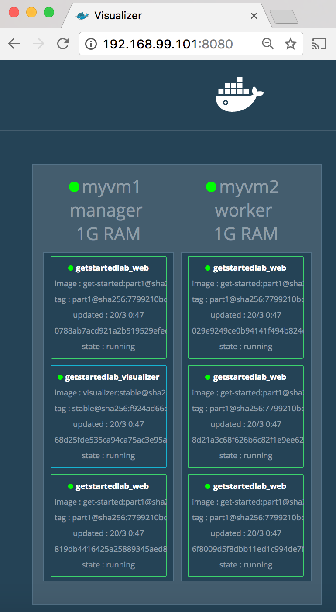

<ul class="pagination">
  <li><a href="index.md">Part 1</a></li>
  <li><a href="part2.md">Part 2</a></li>
  <li><a href="part3.md">Part 3</a></li>
  <li><a href="part4.md">Part 4</a></li>
  <li class="active"><a href="part5.md">Part 5</a></li>
  <li><a href="part6.md">Part 6</a></li>
  <li><a href="part7.md">Part 7</a></li>
</ul>

## Prerequisites

- [Install Docker](/engine/installation/).
- Read the orientation in [Part 1](index.md).
- Learn how to create containers in [Part 2](part2.md).
- Make sure you have pushed the container you created to a registry, as
  instructed; we'll be using it here.
- Ensure your image is working by
  running this and visiting `http://localhost/` (slotting in your info for
  `username`, `repo`, and `tag`):

  ```
  docker run -p 80:80 username/repo:tag
  ```
- Have a copy of your `docker-compose.yml` from [Part 3](part3.md) handy.
- Have the swarm you created in [part 4](part4.md) running and ready.

## Introduction

In [part 4](part4.md), you learned how to set up a swarm, which is a cluster of
machines running Docker, and deployed an application to it, with containers
running in concert on multiple machines.

Here in part 5, you'll reach the top of the hierarchy of distributed
applications: the **stack**. A stack is a group of interelated services that
share dependencies, and can be orchestrated and scaled together. A single stack
is capable of defining and coordinating the functionality of an entire
application, though very complex applications may want to use multiple stacks.

Some good news is, you have technically been working with stacks since part 3,
when you created a Compose file and used `docker stack deploy`. But that was a
single service stack running on a single host, which is not usually what takes
place in production. Here, you're going to take what you've learned and make
multiple services relate to each other, and run them on multiple machines.

## Adding a new service and redploying.

It's easy to add services to our `docker-compose.yml` file. First, let's add
a free visualizer service that lets us look at how our swarm is scheduling
containers. Open up `docker-compose.yml` in an editor and replace its contents
with the following:

```
version: "3"
services:
  web:
    image: docs/get-started:part2
    deploy:
      replicas: 5
      restart_policy:
        condition: on-failure
      resources:
        limits:
          cpus: "0.1"
          memory: 50M
    ports:
      - "80:80"
    networks:
      - webnet
  visualizer:
    image: dockersamples/visualizer:stable
    ports:
      - "8080:8080"
    volumes:
      - "/var/run/docker.sock:/var/run/docker.sock"
    deploy:
      placement:
        constraints: [node.role == manager]
    networks:
      - webnet
networks:
  webnet:
```

The only thing new here is the peer service to `web`, named `visualizer`. You'll
see two new things here: a `volumes` key, giving the visualizer access to the
host's socket file for Docker, and a `placement` key, ensuring that this service
only ever runs on a swarm manager -- never a worker. That's because this
container, built from [an open source project created by
Docker](https://github.com/ManoMarks/docker-swarm-visualizer), displays Docker
services running on a swarm in a diagram.

Copy this new `docker-compose.yml` file to the swarm manager, `myvm1`:

```
docker-machine scp myvm1 docker-compose.yml myvm1:~
```

Now just re-run the `docker stack deploy` command on the manager, and whatever
services need updating will be updated:

```
$ docker-machine ssh myvm1 "docker stack deploy -c docker-compose.yml getstartedlab"
Updating service getstartedlab_web (id: angi1bf5e4to03qu9f93trnxm)
Updating service getstartedlab_visualizer (id: l9mnwkeq2jiononb5ihz9u7a4)
```

You saw in the Compose file that `visualizer` runs on port 8080. Get the IP
address of the one of your nodes by running `docker-machine ls`. Go to either IP
address @ port 8080 and you will see the visualizer running:



The single copy of `visualizer` is running on the manager as you expect, and the
five instances of `web` are spread out across the swarm. You can corroborate
this visualization by running `docker stack ps <stack>`:

```
docker-machine ssh myvm1 "docker stack ps getstartedlab"
```

This visuaizer is good to add to any stack. It's agnostic about what you're
running and where, and doesn't depend on any other service.

Now let's a service that *does* involve a dependency: the Redis service that
will provide a visitor counter.


## Creating a dependency

Linking services together in a stack requires only a few characters of text in
the Compose file but the implications are powerful. Once two services are
linked, they will always be spun up in the correct order so that the dependency
does not break.

Go through the same workflow once more. Save this new `docker-compose.yml` file,
upload it to `myvm1`, and re-run `docker stack deploy`.

```
```


End!

[On to Part 6 >>](part6.md){: class="button outline-btn"}
